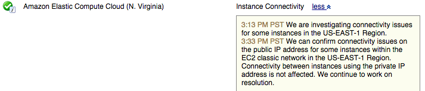
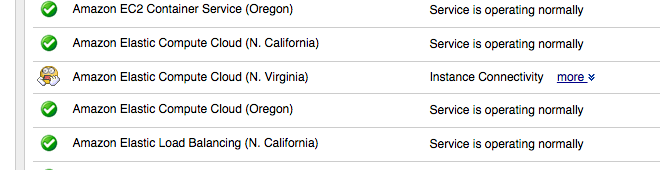

# an extension that changes the green check mark with that little i into something more representative of what that situation means

## before

## after

## how to use

I think you can download that crx file in the main dir and double click?

